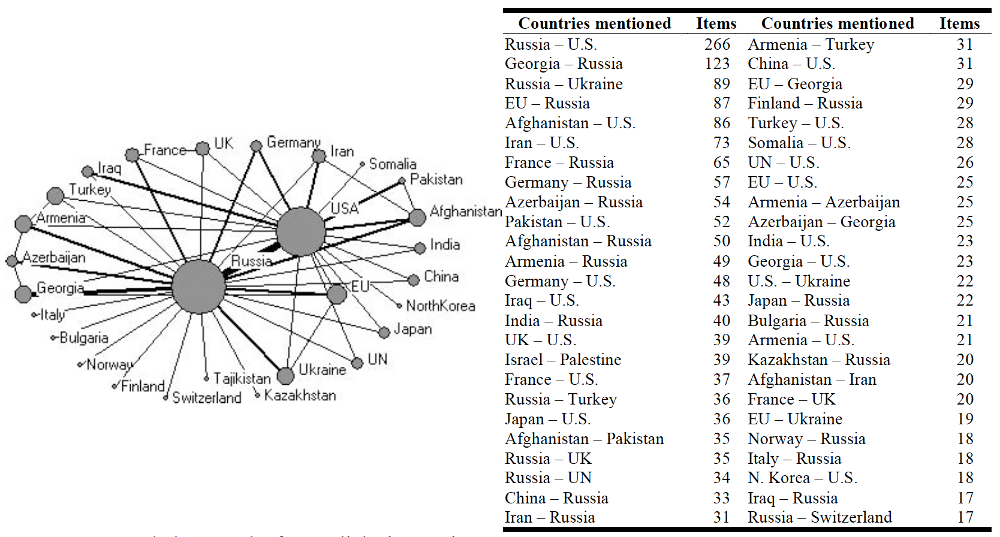
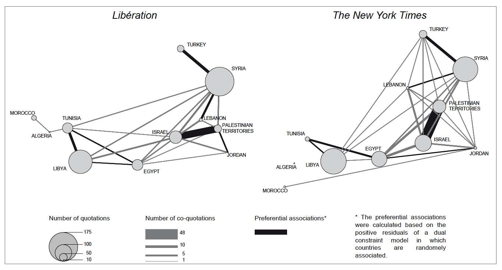
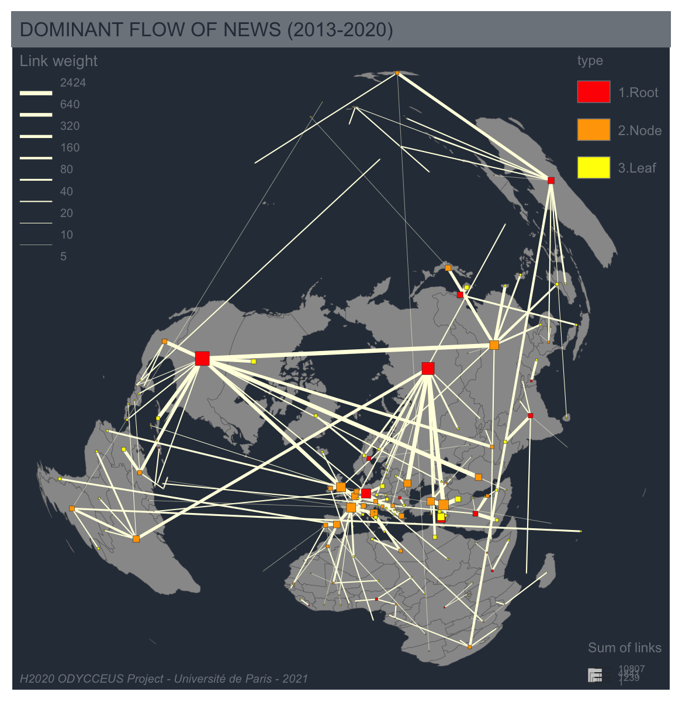

```{r setup, include=FALSE}
knitr::opts_chunk$set(echo = FALSE, warning = FALSE, message =FALSE, error = FALSE)
library(kableExtra)
library(quanteda)
library(data.table)
library(dplyr)
library(tidyr)
library(ggplot2)
library(sf)
library(cartography)
library(mapsf)
library(knitr)
```


## DATA PREPARATION

### Load hypercube

We have collected titles of news declared as *international*  as long as we have depicted the existence of at less one foreign country in the text of the title. In each of the 5 countries, we have selected three newspapers with national audience and available through mediacloud database from mid 2013 to mid 2020. 

```{r}
hc_FRA<-readRDS("corpus/FRA/hc_FRA_states_mobil.Rdata")
hc_FRA<-hc_FRA[who %in%  c("fr_FRA_lmonde", "fr_FRA_figaro","fr_FRA_lacroi"),]
hc_FRA[,.N,list(who)]

hc_DEU<-readRDS("corpus/DEU/hc_DEU_states_mobil.Rdata")
hc_DEU<-hc_DEU[who %in%  c("de_DEU_suddeu", "de_DEU_diewel","de_DEU_frankf"),]
hc_DEU[,.N,list(who)]


hc_GBR<-readRDS("corpus/GBR/hc_GBR_states_mobil.Rdata")
hc_GBR<-hc_GBR[who %in%  c("en_GBR_guardi", "en_GBR_indept","en_GBR_dailyt"),]
hc_GBR[,.N,list(who)]

hc_ITA<-readRDS("corpus/ITA/hc_ITA_states_mobil.Rdata")
hc_ITA<-hc_ITA[who %in%  c("it_ITA_stampa", "it_ITA_repubb","it_ITA_messag"),]
hc_ITA[,.N,list(who)]

hc_ESP<-readRDS("corpus/ESP/hc_ESP_states_mobil.Rdata")
hc_ESP<-hc_ESP[who %in%  c("es_ESP_mundo", "es_ESP_abcxxx","es_ESP_percat"),]
hc_ESP[,.N,list(who)]

hc<-rbind(hc_FRA,hc_DEU,hc_GBR, hc_ITA, hc_ESP)


hc<-hc[order<4,]
exclude_countries <-c("SDS","COG","GIN")
hc<-hc[!(where1 %in% exclude_countries),]
hc<-hc[!(where2 %in% exclude_countries),]

```

### Load geometrical informations

```{r}
# Load maps
world_ctr<-st_centroid(st_read("map/world_of_states_2020.shp", quiet =T),of_largest_polygon = T)
world_map<-st_read("map/world_of_states_2020_simplified.shp", quiet=T)


# Project : Lambert Azimuthal - center = Paris
world_ctr = st_transform(world_ctr, 
                           crs = "+proj=laea +x_0=0 +y_0=0 +lon_0=0 +lat_0=90")
world_map= st_transform(world_map, 
                           crs = "+proj=laea +x_0=0 +y_0=0 +lon_0=0 +lat_0=90")

```


## TRIADIC NETWORKS OF INTERNATIONAL RELATION

In this section, we propose to demonstrate the interest of an analysis of triadic network of international relations which can be briefly defined as the *perception of the relation between two countries by the media of another country*. In terms of cultural conflict, it is indeed of utmost importance to take into account the role of *third party* which can be observer but also actors in the dynamic of opinion at global scale.  If we consider for example the crisis of Crimea, it is typically an example of conflictual geopolitical link (between Ukraine and Russia) which is perceived and reported differently in chinese, indian or german newspapers. The same would be true for the geopolitical links between Israel and Palestine, Northern and Southern Korea, USA and Venezuela, etc.

But triadic network of international relation are not necessarily related to conflicts and can also be simply associated to the production of a perception of the geopolitical equilibrium of contemporary world. Linkage between countries can indeed be related to sports, arts, science, trade, ... But in every case they are not randomly distributed across the world and the importance of the links depends from the focus of the media which produce a localized vision of the world. 


### Network approach of foreign news

The method of co-quotation of countries has been firstly applied by Segev (2010) on a large sample of 35 news sites collected between 1st of February 2009 and 31st of July 2009. The objective of Segev was to  reveal the existence of different type of networks of international news according to the place allocated to the host country where the media are located. For this reason he did not exclude the links between the host country and the other countries from the network of triadic relation. And he demonstrated the existence of various types of networks of foreign news illustrated by for examples :

- *Self centered network* : like US newspapers where the majority of international links is related to the home country.
- *Global and regional networks* : like German newspapers where a dominant node is centered on the US but a secondary node on Germany in relation with more local relation in the EU
- *Two-hub networks* : like Russian newspapers  where the network of international news is characterized by two cores of equal importance,  US and Russia.
- *Regional network* : like Egyptian news where the network is not characterized by a dominant hub but by a mixture of countries of equal importance (Egypt, Israel, Palestina , USA, Syria, Lebanon)


```{r}

```

The analysis of co-occurence of countries in foreign news has been also proposed by Grasland, Giraud & Severo (2011,2016) in a paper about the perception of Arab Spring in the title of news published by the  *New York Time* and *Liberation* between 11 May and 9 August 2011. In these case, the research focused on the linkages established by media between countries located in eastern and southern Mediterranean where the Arab Spring took place.  

```{r}

```


The authors demonstrated through this approach the existence of a systemic perception of the geopolitcal transformation occuring in the southern and eastern Mediterranean.  But the analysis revealed also different focus in the US and french newspaper. The network of the NYT is more focused on the eastern part of the area with a major interest in the case of the Israel-Palestin conflict but also in the Syrian civil war. The network of the french newspaper Liberation is also focused on the Israel-Palestin conflict but provide more attention to the Tunisia and the other countries from Maghreb. This differences are in line with geopolitical priorities which were not exactly the same for France and USA during this period of time


### Triadic networks of international relation

The association of two countries in the news published by a media located in another country can be used for the definition of **triadic networks of international relation**. 

- $\mathcal{N}_{ij}^{m}$ : number of associations of countries i and j in the same sentences (title or description) of the news published by the media m from country k. 

As we are focusing on international relation, we exclude the links related to the country where the media is located. Contrary to Segev (2010), we consider that it is difficult to decide when the country where the media is located is present or absent from a news. In our opinion, the host country of the media define  *first order dyads (media form country k is speaking about foreiogn country i)*  that should not be confused with the *second order triads (foreign countries i and j are co-mentionned in news from media k)*. It is the reason why we introduce the condition :  

- $(i \neq k)$ and $(j \neq k)$

It is possible to realize an aggregation of the triadic netwoks of different media located in the same country :

- $\mathcal{N}_{ij}^{k} = \sum_{m \in k } \mathcal{N}_{ij}^{m}$

Or for a set of countries $K = {k_1... k_n}$ like the five countries of western Europe where our sample of media is located. 

- $\mathcal{N}_{ij}^{K} = \sum_{k \in K} \mathcal{N}_{ij}^{k}$

But in this case we have to take into account the fact that international relations of the set of countries $K$ are partly underestimated. In our example, the international links between France and Germany can  be reported by british, italian or spanish newspapers. But not directly by french or german newspapers. 

### Top linkages 

```{r}

top<- hc %>% filter(where2 > where1) %>%
             mutate(dyad = paste(where1,where2,sep="-"))%>%
              group_by(dyad) %>% 
              summarise(wgt = sum(news)) %>% 
              mutate(wgt = round(2*wgt)) %>%
              ungroup() %>%
              mutate(rnk = round(rank(-wgt),0),
                     pct = round(100*wgt/sum(wgt),2))%>%
              arrange(rnk)

kable(top[1:20,c(1,2,4)],row.names = 1:20, caption = "Top linkages for media from 5 western European countries (1st July 2013 to 30th June 2020",)

```

The top-20 linkages observed between countries for the 15 newspaper from western Europe appears clearly as a perfect summary of the main geopolitical conflicts and/or the struggle for power  between the main international actors during the period 2013-2020. 

- *Links related to precise conflicts and events* : At the top of the geopolitical agenda we can find the permanent issue of the Israel-Palestine conflict (rank 1), followed by the Russia-Ukraine conflict (rank 2) in relation with the annexion of Crimea in 2014-2015. The war in Syria is also strongly present through links with Russia (rank 3), Turkey (rank 6) or USA (rank 7) or Iraq in relation with ISIS (rank 9). The Middle-East is also present through the conflicts between Iran and USA (rank 8), Russia and Turkey (rank 16) or Saudi Arabia and Yemen (rank 20). Other links from this category are related to the relation between Northern and Southern Korea (rank 11), USA and Mexico about Trump's wall (rank 13) or USA and Cuba (rank 15).

- *Links related to structural relation between major power* : The list provide alos many examples of relations between major states of the world, that can not be assigned to precise events but rather to structural relations of power. This concern obviously the relations between USA and China (rank 4), USA and Russia (rank 5), Great Britain and Russia (rank 14). This structural relations are not necessarily related to negative oppositions and can also probably reveal linkages of friendship or collaboration like in the case of France and Germany (rank 12), France and UK (rank 19) or UK and USA (rank 14). The linkage observed between UK and Belgium (rank 17) is related to a false assignation of "*Bruxelles*" to Belgium instead of European Union. It is in fact related to the Brexit crisis. 


### Geopolitical variations of world vision in western Europe

Do we observe the same distribution of gopolitical priorities in the newspapers of five countries of western Europe ? To answer the question we compute the top geopolitical links for each country, but with the exclusion of the five countries themselves. 

```{r}

exclude_host <- c("FRA","GBR","ESP","ITA","DEU")

top_who<- hc %>% filter(where2 > where1) %>%
             filter(!(where2 %in% exclude_host)) %>%
             filter(!(where1 %in% exclude_host)) %>%
             mutate(dyad = paste(where1,where2,sep="-"),
                    host = substr(who,4,6))%>%
              group_by(dyad, host) %>% 
              summarise(wgt = sum(news)) %>% 
              ungroup() %>%
              group_by(host) %>%
              mutate(rnk = rank(-wgt)) %>%
              filter(rnk < 11) %>%
              pivot_wider(names_from = host, values_from=dyad, id_cols=rnk) %>%
              arrange(rnk) 
top_who<-top_who[,-1]
top_who<-top_who[,order(names(top_who))]

kable(top_who,
      row.names = 1:10, 
      caption = "Variation of top international dyads by host country",
      col.names = c("Germany", "Spain", "France", "U.K.","Italy"))
```

The analysis of the variation of the top international by country of localization of the media reveals a global stability of the pattern of the top-10 couples of foreign countries mentioned. But some interesting variations can be pointed which reveals different focus, different visions of the world. 

- The *Israel-Palestin* conflict appears in first rank of dyads mentionned in all countries, with the exception of Germany where it appears only in 6th rank. If this difference is not related to a problem in the dictionary of countries (**to be verified**) it reveals a real originality of German newspapers as compared to the rest of western Europe? 
- The *Russia-Ukraine* dyad appears in first rank in Germany, in second rank in Spain, France and UK and in third rank in Italy. It is therefore the most consensual topic of geopolitical interest of our sample. 
- *Specific dyads* appears in the top-10 of countries, in relation with cultural proximities inherited from history and related to language or former colonial relations. It is typically the case of the dyads linking Australia and New-Zealand or Australia and India in UK newspapers. Or the high level of the dyads USA-Mexico and USA-Cuba in the case of spanish newspapers 


### A hierarchical network of geopolitical domination in news

The distribution of dyads over a long period of time and for a large set of newspapers offers the possibility to establish an international network of relation which can reveal structural position of countries according to a hierarchy of dominant, intermediary and dominated countries. To establish this hierarchy, we use the method of *dominant flows* initially developped by John D. Nyusten & Michael F. Dacey (1961) for the delineation of nodal regions based on a graph of tecommunication flows between cities. Considering a matrix of weigthed dyads between countries  $\mathcal{N}_{ij}$, the authors consider that a country $i$ is dominated by a country $j$ if two conditions are verified : 

- **Condition 1** : The most important association of country i is with country j : 
  $max_{z}(\mathcal{N}_{iz}) =  \mathcal{N}_{ij}$
 
 - **Condition 2** : The sum of association of country i with other coutries is lower than the one of country j : 
  $\sum_{z} \mathcal{N}_{iz} < \sum_{z} \mathcal{N}_{jz}$ 

For example, the country which is the most associated with China in our sample of newspaper is the USA ($\mathcal{N}_{ij} =  1202$) and the sum of association of USA with other countries ($\mathcal{N}_{j.} =  10807$) is larger than the sum of associations of China with other countries($\mathcal{N}_{i.} =  4486$). Therefore China is "dominated" by USA according to the model of Nyusten & Dacey. 

In the case of Australia, the most associated country is New-Zealand ($\mathcal{N}_{ij} =  227$) but the sum of association of New-Zealand with other countries ($\mathcal{N}_{j.} =  747$) is lower than the sum of associations of Australia ($\mathcal{N}_{i.} =  2256$). In this case, the theory conclude that Australia is not dominated anc can be consider as the core of a network of countries. 
The application of the method to all countries of the world define a graph which is organised as a set of trees with core countries as center of each component of the graph. Countries can be classified in three basic types according to their position in the trees

1. **Roots** are dominant countries, represented in red
2. **Nodes** are countries which are at the same time dominant ane dominated, represented in orange.
3. **Leaf** are countries which are purely dominated, represented in yellow.

The advantage of the method is to produce a simplified but very clear divsion of the network in hierarchical regions centered on a dominant geopolitical actor. The application to our sample of western European newspapers for the period 2013-2020 produce an exciting picture of the world seen by media. 

```{r}
exclude_countries <-c("SDS","COG","GIN")
net<- hc %>% filter(where2 != where1) %>%
             filter(!where1 %in% exclude_countries) %>%
              filter(!where2 %in% exclude_countries) %>%
              group_by(where1,where2) %>% 
              count(wt = sum(news),)%>% 
              ungroup()
names(net)<-c("i","j","Fij")


flows_to_dom<-function (flows=flows) 
  {
flowi<-flows%>%group_by(i)%>%summarise(Fi=sum(Fij))%>%ungroup()
flowj<-flows%>%group_by(j)%>%summarise(Fj=sum(Fij))%>%ungroup()
flows<- flows%>%left_join(flowi)%>%left_join(flowj)   
dom <- flows%>%arrange(desc(Fi))%>%
            arrange(desc(Fij))%>%
            arrange(desc(Fj))%>%
            group_by(j)%>%
            mutate(dom=row_number())%>%
            ungroup()%>%
           filter(dom==1)%>%
            filter(Fi>Fj )
 return(dom) 
}
dom<-flows_to_dom(net)


dom1<-dom %>% select(i,Fi) %>% unique()
dom2<-dom %>% select(j,Fj) %>% unique()
domA <- dom1 %>% filter(!i %in% dom2$j) %>% rename (ISO3=i, link=Fi) %>% mutate(type = "1.Root") 
domB <- dom1 %>% filter(i %in% dom2$j)  %>% rename (ISO3=i, link=Fi) %>% mutate(type = "2.Node")
domC <- dom2 %>% filter(!j %in% dom1$i) %>% rename (ISO3=j, link=Fj) %>% mutate(type = "3.Leaf")
dom_type<-rbind(domA,domB,domC)

world_nodes<-merge(world_ctr,dom_type,by="ISO3")


world_links <- mf_get_links(x = world_ctr, df = dom[,1:3])

world_links2 <- world_links %>% filter(Fij >10) 


# import the sample data set
# Initiate a base map
mf_init(x = world_map, theme ="dark",
        res = 200,
        width = 1500,
        height = 1200,
        export="png",
        filename = "img/DomNews_global.png")

# Plot a shadow
#mf_shadow(world_map, add = TRUE,cex = 0.3, col = "gray80")

# Plot empty map
mf_map(world_map, type = "base", add = TRUE, border= "gray40", lwd=0.3,col="gray60",)

# Plot links
mf_map(world_links, 
       col = "lightyellow", 
       type = "grad", 
       var = "Fij",
       leg_pos = "topleft",
       leg_val_rnd = 0,
       leg_title = "Link weight",
       breaks = c(5,10,20,40,80,160,320,640,max(world_links$Fij)),
       lwd=c(0.25,0.5,1,1.5,2,2.5,3,3.5),
       add = TRUE)


# plot nodes by type and size
mf_prop_typo(
  x = world_nodes, 
  var = c("link", "type"), 
  inches = .06, 
  border = "gray20",
  symbol = "square", 
  col_na = "grey", 
  pal = c("red","orange","yellow"),
  lwd = 0.3,
  leg_pos = c("bottomright", "topright"),
  leg_title = c("Sum of links", "type"),
  leg_title_cex = c(0.7, 0.7),
  leg_val_rnd = 0,
  leg_val_cex = c(.5, .7),
  val_order = c("1.Root","2.Node","3.Leaf"),
  leg_no_data = "No data",
  leg_frame = c(FALSE, FALSE),
  add = TRUE
)


# layout
mf_layout(title = "DOMINANT FLOW OF NEWS (2013-2020)",
          scale = FALSE,
          arrow=FALSE,
          credits = "H2020 ODYCCEUS Project - Université de Paris - 2021")

```


```{r}

```


The map reveals firstly the existence of three giant trees centered respectively on USA, Russia and European Union. 

- **The American network** is firstly centered on countries from northern and central america, with the relay of nodes located in Mexico and Venezuela, but excluding the southern part of the continents which is polarized by Russia through Brazil. 

- **The Russian network** covers firstly countries from forme Soiet Union, Central Asia and Middle East, with very important linkages with Ukraine on the one hand, Syria and Turkey on the other hand. The impôrtance of the Russian network has clearly grown during the last years and was less important in the previous work realized by Elad Segev in 2009. Without any doubt, the geopolitical activism of Russia is reflected by the media. More suprinsingly, Russia appears also strongly connected with Brazil which is a relay for the southern part of Latin America. The explanation of this linkage is probably to be found to the events of the Olympic Games of 2016 in Brazil where Russia was initially excluded and finally accepted. 


